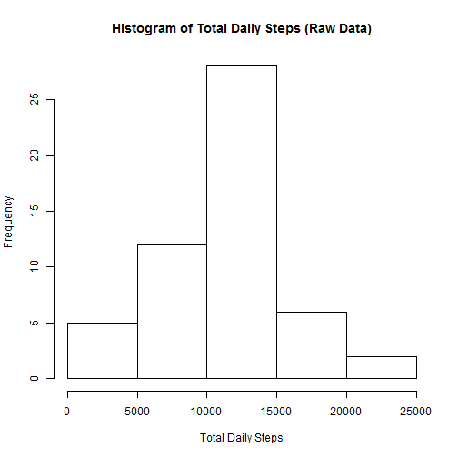
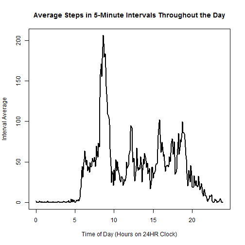
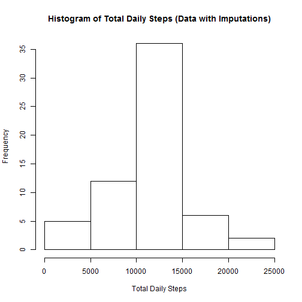

Coursera Class - Reproducible Research Project 1
==========================
Dr. John R. Withrow, Jr.

**Data Acquisition: Web Source**  
New objects created:  
  activity_wna - Raw data (includes NA's)  
**Data Description**    
Web Source: https://d396qusza40orc.cloudfront.net/repdata%2Fdata%2Factivity.zip  
Contents:  One file, activity.csv, type CSV, 17568 observations of 3 variables  
steps - Number of steps taking in a 5-minute interval (missing values are coded as NA)  
date - The date on which the measurement was taken in YYYY-MM-DD format  
interval - Identifier for the 5-minute interval in which measurement was taken

```r
setwd("C:\\Users\\John\\Desktop\\Projects\\RR_Project1\\")
download.file("https://d396qusza40orc.cloudfront.net/repdata%2Fdata%2Factivity.zip","file1.zip")
unzip("file1.zip",exdir="c:\\Users\\John\\Desktop\\Projects\\RR_Project1")
activity_wna <- read.csv("activity.csv")
```

***

**Cleaning: Setting Date field to type Date**  

```r
activity_wna$date <- as.Date(as.character(activity_wna$date))
```

***

**Manipulation: Creation of Different Necessary Versions of the Data Set**  
New objects created:  
  activity - Complete Cases only  
  activityfull - DataFrame showing matrix of steps showing intervals as rows and dates as columns

```r
activity <- activity_wna[complete.cases(activity_wna),]
interval_list <- sort(rep(seq(0,2300,100),12)) + rep(seq(0,55,5),24)
interval_list_decimal <- sort(rep(seq(0,23),12)) + rep(seq(0,55,5),24)/60
date_list <- unique(activity_wna$date)
activityfull <- as.matrix(rep(0,length(date_list)*length(interval_list)))
dim(activityfull) <- c(length(interval_list),length(date_list))
for (i in 1:length(interval_list))
{
  for (j in 1:length(date_list))
  {
    activityfull[i,j] <- activity_wna$steps[activity_wna$interval==interval_list[i] & activity_wna$date==date_list[j]]
  }
}
activityfull <- as.data.frame(activityfull)
colnames(activityfull) <- date_list
row.names(activityfull) <- interval_list
```

***

**Calculation of Total Steps for Each Date**  
New objects created:  
  totals - data frame with columns date (activity date), steps (daily total steps)

```r
totals <- data.frame(date=unique(activity$date),steps=tapply(activity$steps,activity$date,FUN=sum))
```

***

**Histogram of Total Steps with Additional Statistics**  

```r
par(mfrow=c(1,1))
par(mar= c(5, 4, 4, 2) + 0.1)
hist(totals$steps,xlab="Total Daily Steps",main="Histogram of Total Daily Steps (Raw Data)")
```



Mean of Daily Total Steps: 1.0766189 &times; 10<sup>4</sup>    
Median of Daily Total Steps: 10765

***

**Calculation and Plotting of Interval Means and Time of Largest Mean**  
New objects created:  
  activitymean - interval averages for activity
  maxinterval - interval of highest average

```r
activitymean <- tapply(activity$steps,activity$interval,mean)
plot(interval_list_decimal,activitymean,type='l',lwd=2,col="black",xlab="Time of Day (Hours on 24HR Clock)", ylab="Interval Average")
title("Average Steps in 5-Minute Intervals Throughout the Day")
```



```r
maxinterval <- interval_list[activitymean==max(activitymean)]
```

Time of Day of Largest Average Steps: 835

***

**Missing Data Points**  
New objects created:  
  totalNAs - total number of missing data points

```r
totalNAs <- length(activity_wna$steps[is.na(activity_wna$steps)])
```

Total Number of Missing Data Points: 2304  

***

**Imputation for Missing Data**  
Instances of missing data (NA) were observed as only occurring for certain days.  All such days
were found to consist only of missing values.  Imputation took the form of replacing all such
data points with average values for the given interval.  In other words, step values for such 
days were assumed to be those of an average day.  This should inflate the center of the histogram
plot, as it will increase the number of average days.

```r
for (i in 1:length(interval_list))
{
  for (j in 1:length(date_list))
  {
    if (is.na(activityfull[i,j])) { activityfull[i,j]<-activitymean[i] }
  }
}
```

***

**Plotting of New Histogram of Daily Total Steps**  
New objects created:  
  totalsfull - daily averages for activityfull (now with imputed data)

```r
totalsfull <- numeric(0)
for (i in 1:dim(activityfull)[2]) { totalsfull <- c(totalsfull,sum(activityfull[,i])) }
totalsfull <- data.frame(date=date_list,totalsteps=totalsfull)
hist(totalsfull$totalsteps,xlab="Total Daily Steps",main="Histogram of Total Daily Steps (Data with Imputations)")
```



Mean of Daily Total Steps: 1.0766189 &times; 10<sup>4</sup>    
Median of Daily Total Steps: 1.0766189 &times; 10<sup>4</sup>  
As anticipated, the mean does not change, since what was added were complete sets of average days,
and the addition of such average days strengthens the central peak of the distribution, bringing
the median and mean closer together.

***

**Separating activityfull matrix by weekday/weekend**  
New objects created:  
  activityfullweekend - portion of activityfull covering weekend dates  
  activityfullweekday - portion of activityfull not covering weekend dates  
  activitymeanweekend - interval averages for activityfullweekend  
  activitymeanweekday - interval averages for activityfullweekday

```r
weekend <- c("Saturday","Sunday")
dayorend <- as.numeric(weekdays(date_list) %in% weekend)
levels(dayorend) <- c("weekday","weekend")
activityfullweekend <- activityfull[,which(dayorend==1)]
activityfullweekday <- activityfull[,which(dayorend==0)]
activitymeanweekday <- numeric(0)
activitymeanweekend <- numeric(0)
for (i in 1:dim(activityfullweekday)[1])
{
  activitymeanweekday <- c(activitymeanweekday,mean(as.numeric(activityfullweekday[i,])))
  activitymeanweekend <- c(activitymeanweekend,mean(as.numeric(activityfullweekend[i,])))
}
```

***

**Comparative Plot of Interval Averages for Weekdays and Weekends**  

```r
par(mfrow=c(2,1))
par(mar=c(0,4,4,0))
par(xaxt="n")
plot(interval_list_decimal,activitymeanweekday,type="l",lwd=2,col="red",xlab="",ylab="Steps")
text(2,175,"Weekdays",col="red")
title("Average Steps in 5-Minute Interval on Weekdays and Weekends")
par(mar=c(4,4,0,0))
par(xaxt="s")
plot(interval_list_decimal,activitymeanweekend,type="l",lwd=2,col="blue",xlab="Time of Day (Hours on 24HR Clock)",ylab="Steps")
text(2,100,"Weekends",col="blue")
```


Early morning steps are higher on weekdays, while afternoon steps are higher on weekends.

***

**Analysis Conclusion**
